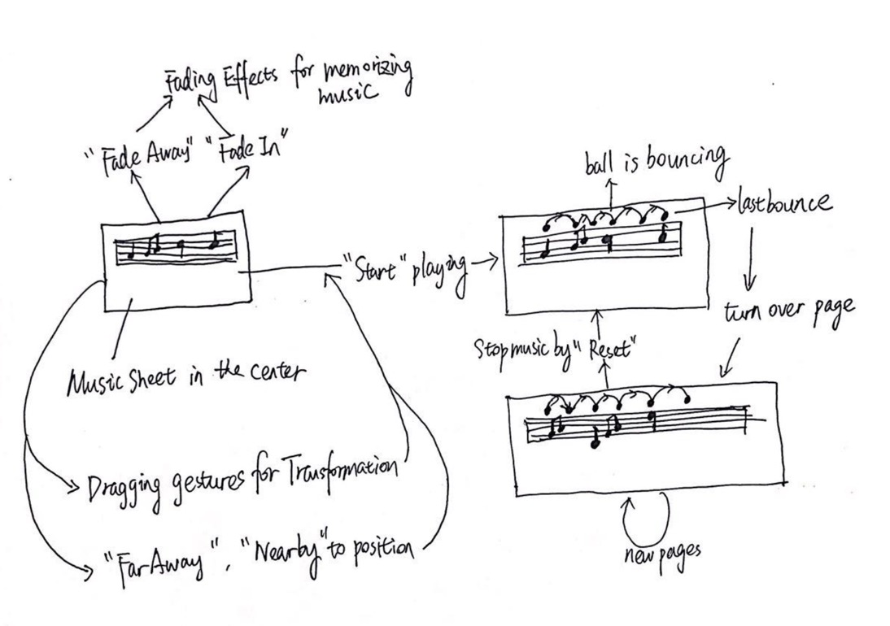

# Augmented Reality for Music Performance #

[This software now supports stable Mixed Reality Tookit 2017.4.2.0+ exposed in Unity and it is an early prototype]

This is a native [Unity](https://unity3d.com/) plugin that exposes the functionality of Microsoft
[Mixed-Reality Toolkit (MRTK)](https://github.com/microsoft/MixedRealityToolkit-Unity) to your Unity projects for compatible Windows device -- 
[HoloLens](https://www.microsoft.com/en-us/hololens/buy).  
This documentation assumes that the developers are familiar with Unity software and Mixed-Reality Toolkit framework and the operations of HoloLens. 
It includes features such as spatial map tracking, cursor, voice commands recognition, customer shader for transparancy, 
dragging gestures, position calculation for movements,
Input Systems and raycast hit testing API to Unity developers for this AR projects.

This sdk is a _preview quality_ build that
will help us to develop applications on HoloLens get up and running quickly, but the implementation and APIs are subject to change 
through the update of MRTK and the updated generation of the HoloLens.  (For HoloLens 2nd generation, MRTK might have a great difference)
Nevertheless, it is quite capable of creating a full featured MRTK HoloLens app, and nearly all of HoloLens apps im the Windows shop are implemented by
MRTK.

## HCI Info as Background ##

The software is created for the HCI experiment initially. So the HCI experiment is intrduced in this section.
There are 3 phases for the experiment. 

* The first one is to visualize the music sheet and musical pointer which is a bouncing ball
* The second one is visualizing the fading effects as if memorizing music 
* The third one is to let the users position the music further away or nearby, and user could drag the sheet

The goal of this project is to help the musicians' cooperation performance. So we conduct experiments on 2 focus groups with 3 participants for each group. 

At first, an drawn prototype is created as the following figure and then the coding and application is finalized as the link 
[https://www.youtube.com/watch?v=FISCvoh2MTM](https://www.youtube.com/watch?v=FISCvoh2MTM) .

 

A series of qualitative data has been analyzed through and several obvious suggetions have been extracted for the future work as the following figure shows.
 


## Requirements: ##

_Following requirements including software, hardware and scene:_

* [Unity](https://unity3d.com/get-unity/download) v2017.4
* Visual Studio 2017 or later
* Windows platform 10 sdk 
* Microsoft [Mixed-Reality Toolkit](https://github.com/microsoft/MixedRealityToolkit-Unity/releases/tag/2017.4.2.0) 2017.4.2.0 
* HoloLens (1st generation)
* Alieneware Area-51 supports Windows 10 operating system
* Latest HoloLens operating system
* A quiet and light place for experiment 


## Building ##

Downloading the file and open this whole project in Unity version 2017.4 or later. 
Notice that this artefact is really huge which might give some opening problems in a short time.

Choose [Unity file called AR_music](./artifacts/Assets/AR_music) and open it in Unity. 
You could open the scene called [Test.unity](./artifacts/Assets/AR_music/Test.unity) and change the scene setting and objects.
You could also change the [Scripts](./artifacts/Assets/AR_music/Scripts) in this files. All the C# scripts are collected in this file.
Users could build the scene to Windows Platform and HoloLens device.
After this project has been built, a solution file is built.
This file has been in it, so users can directly open [Solution file in app](./artifacts/App/TEST.sln) test module. 
Click it and build as [here](https://docs.microsoft.com/en-us/windows/mixed-reality/using-visual-studio#enabling-developer-mode) 


## Scripts and API overview ##

Scene design is mainly deployed in [ AR_music](./artifacts/Assets/AR_music)   


<h4>Main Scripts</h4>

There are many scripts. Only important functional scripts are listed so far.
[Commands.cs](./artifacts/Assets/AR_music/Scripts/Commands.cs), [Gesture.cs](./artifacts/Assets/AR_music/Scripts/Gesture.cs),
[GlobalCursor.cs](./artifacts/Assets/AR_music/Scripts/GlobalCursor.cs) are important imput detection and cursor 
interaction script learned form [Academy](https://docs.microsoft.com/en-us/windows/mixed-reality/holograms-101)(HoloLens learning tutorial).

[Bounce.cs](./artifacts/Assets/AR_music/Scripts/Bounce.cs) The main script to reset and start bouncing the ball:
The following functions are caluculating the ball local position, creating the bouncing effect.
When the ball triggered the end of music sheet and turn over the page 

```CSharp

void turnPage()
void StartPlay()

```


```CSharp

start = sphere.transform.localPosition;
end = new Vector3(sphere.transform.localPosition.x - 0.35f, sphere.transform.localPosition.y, sphere.transform.localPosition.z);
// lerp the musical pointer from start to the end
sphere.transform.localPosition = Vector3.Lerp(start, end, t);
sphere.transform.localPosition = new Vector3(sphere.transform.localPosition.x,sphere.transform.localPosition.y, originalPosition.z + Mathf.PingPong(Time.time * 5f, 2.0f));

```

[Fadein.cs](./artifacts/Assets/AR_music/Scripts/Fadein.cs) 
This script create the fade in effects. I create and find the transparency shader. Increase the shader factor to fade in.
Transparency shader is in [Fadein.cs](./artifacts/Assets/AR_music/Materials/Transparency_shade.shader) 

```CSharp

rend.material.shader = Shader.Find("Transparency"); // find shader 

transparency = Mathf.Lerp(transparency, transparency + 0.2f, Time.deltaTime*0.5f);
// fade in effects

```

[Fadeout.cs](./artifacts/Assets/AR_music/Scripts/Fadeout.cs) 
This script create the fade out effects. I create and find the transparency shader. Decrease the shader factor to fade out.
Transparency shader is in [Fadein.cs](./artifacts/Assets/AR_music/Materials/Transparency_shade.shader) 

```CSharp

rend.material.shader = Shader.Find("Transparency"); // find shader 

transparency = Mathf.Lerp(transparency, transparency - 0.2f, Time.deltaTime*0.5f);
// fade out effects

```


[MoveSheet.cs](./artifacts/Assets/AR_music/Scripts/MoveSheet.cs) 
This script move the sheet futher away or closer to the main camera.

```CSharp

MusicSheet.transform.position = distance * 1.2f + Camera.main.transform.position;
// intuitively set parameter to move away

MusicSheet.transform.position = distance * 0.8f + Camera.main.transform.position;
// intuitively set parameter to move in

```

```CSharp

void MoveAway()
void MoveIn()

```

<h4>Important API</h4>

Refer to 
[https://docs.unity3d.com/ScriptReference/Windows.Speech.KeywordRecognizer.html](https://docs.unity3d.com/ScriptReference/Windows.Speech.KeywordRecognizer.html)
This link show the detailed information of keywordrecognizer in Unity.

[Voice commands](./artifacts/Assets/AR_music/Scripts/Voice.cs) 

_Following are the keywords set in this application:_

<b>Disappear</b> : fade away the music sheet.  <b>broadcast "FadeAway"</b>

<b>Appear</b> : fade in the music sheet. <b>broadcast "Appear"</b>

<b>Reset</b> : reset both the music sheet and musical pointer. <b>broadcast "Reset"</b>

<b>Start</b> : start bouncing the ball.  <b>broadcast "FadeAway"</b>

<b>Far away</b> : Set the music sheet further away.  <b>broadcast "MoveAway"</b>

<b>Near by</b> : Set the music sheet Near by.  <b>broadcast "MoveIn"</b>

```CSharp

#if !UNITY_EDITOR
        // Tell the KeywordRecognizer about our keywords.
        keywordRecognizer = new KeywordRecognizer(keywords.Keys.ToArray());

        // Register a callback for the KeywordRecognizer and start recognizing!
        keywordRecognizer.OnPhraseRecognized += KeywordRecognizer_OnPhraseRecognized;
        keywordRecognizer.Start();
#endif

void OnGUI()


```
Set keywords as phrases only debug the editor which is not unity. If it is Unity play mode. 
Use GUI to create button to trigger the function for debugging.
Create button by GUILayout.Button("Button Name")


  

## Useful components ##
<h4>Mixed-Reality Toolkit</h4>
I use the MRTK default scene in this package. There is a default cursor as 3-D model to use and set the environment of HoloLens.


<h4>Unity</h4>
MRTK is based on the development Unity in C#.


### Demo for this app ###

The detailed demo operations are videoed in the link [https://www.youtube.com/watch?v=FISCvoh2MTM](https://www.youtube.com/watch?v=FISCvoh2MTM) 

### Mixed Reality Toolkit Update ###

The [Mixed-Reality Toolkit package](https://github.com/microsoft/MixedRealityToolkit-Unity) is updated from time to time.
It could be updated after each milestones by the Microsoft. 

## Questions?  Bugs? Showcase? ##

Contact Zeruo.Liu@anu.edu.au if there are some further questions 


